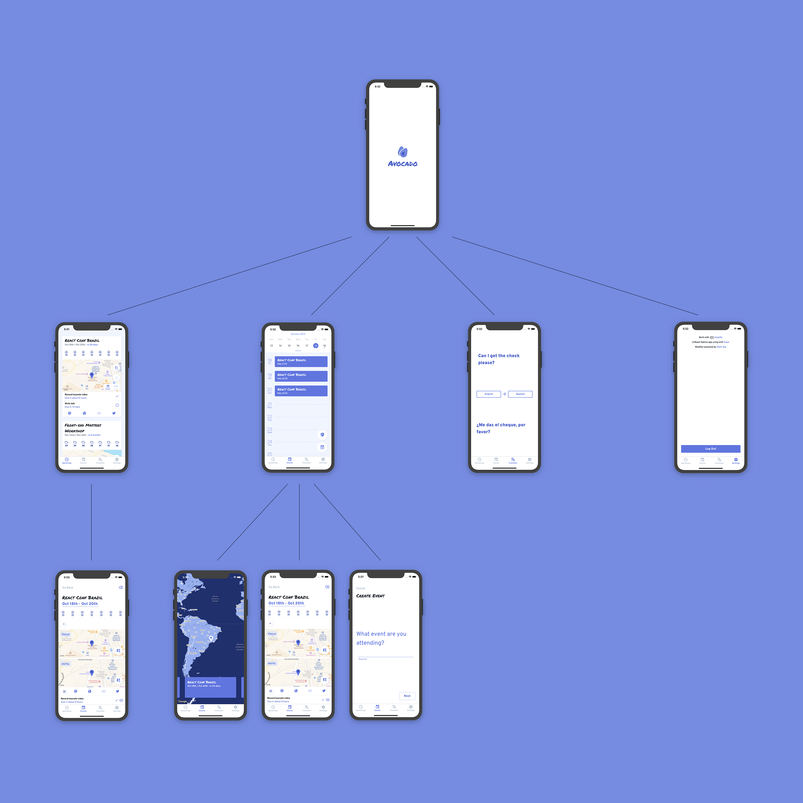

# Avocado

An app for managing your future engagements. Easily figure out what your upcoming iteneray is including the weather forecast for the weeek of the event, as well as tracking any tasks you may need to get done before you head off, and realtime translations to over a dozen languages.

## Infrastructure

### Authentication

Authentication and authorization is handled by Amazon Coginito. Amazon Cognito is a ...

### API + Data Storage

The app uses GraphQL via AWS AppSync and storage is handled with Amazon DynamoDB, both are orchestrated through Amplify. The schema found at `./amplify/backend/api/avocado` defines what be deployed in AWS. The custom `@model` directive defines what types will have tables created for them in DynamoDB. This is part of the custom `GraphQL Transforms` tooling that comes with Amplify...

### Serverless Functions

To fetch the weather data for events, an AWS Lambda function is used as a resolver for the `weather` field on the `Event` type in `./amplify/backend/api/avocado/schema.graphql`. Amplify then creates the necessary config to wire the API and function together. Providing access to the event's data and any arugments that might be present on the field...

## Machine Learning

The translations in the app are done via Amazon Translate. The Amplify `Predictions` module is used to set up a real-time connection to Amazon Translate for instant translations...

## UI

The app is built with React Native using Expo to manage the app life-cycle, as well as using many Expo modules to speed up development. Google places is used to get geolocations and addresses for venues and hotels. The Amplify package and Amplify React package are also used to speed up development time...
